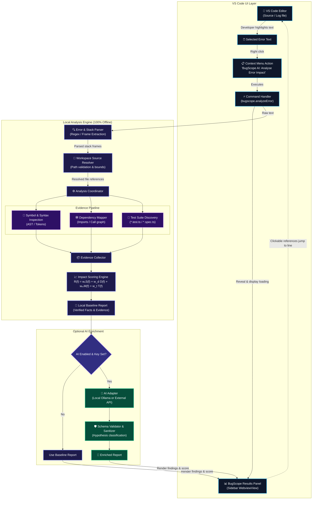

# BugScope AI — Master Technical Architecture & Engineering Plan

> **VS Code-Native · Local-First · Evidence-Driven**  
> *Understand an error, trace its potential impact, and prioritise what to investigate next — without leaving the editor.*

---

<div align="center">

| ⏱️ Execution Model | 🔌 Core Offline Capability | 🎯 Target Platform |
| :---: | :---: | :---: |
| **Production-Grade Architecture** | **Zero API Key Needed (Local-First)** | **VS Code Extension (TypeScript)** |

</div>

---

## 1. Locked User Experience (The Core Loop)

> [!IMPORTANT]
> This interaction is the first vertical slice we implement and test — not a superficial UI layer deferred until the end.

```
┌─────────────────────────────────────────────────────────────────────────────────┐
│ [1. Select Error] ──▶ [2. Right-Click] ──▶ [3. Trigger Panel] ──▶ [4. Inspect]  │
└─────────────────────────────────────────────────────────────────────────────────┘
```

### Step 1 — Select the Error Text
The developer highlights a stack trace or error message inside any supported VS Code editor (e.g., a `.log`, `.ts`, `.js`, or output buffer):

```text
TypeError: Cannot read properties of undefined (reading 'rate')
    at calculateDiscount (checkout.ts:42:18)
    at processOrder (orderService.ts:115:9)
    at Object.handleCheckout [as handler] (routes/cart.ts:88:24)
```

### Step 2 — Right-Click the Selection
The editor context menu displays the dedicated BugScope command:
```
┌──────────────────────────────────────────────┐
│  Cut                                         │
│  Copy                                        │
│  ──────────────────────────────────────────  │
│  🔍 BugScope AI: Analyse Error Impact        │  ◀── Registered Context Action
│  ──────────────────────────────────────────  │
│  Command Palette...                          │
└──────────────────────────────────────────────┘
```

### Step 3 — Click BugScope AI
A dedicated **BugScope AI** view immediately activates and focuses in the VS Code Primary Sidebar, displaying an animated loading state while the local engine parses and maps the workspace.

### Step 4 — Inspect Evidence & Navigate
The results panel renders:
- **Error Breakdown:** Parsed exception type, message, and target frame.
- **Candidate Root Causes:** Evidence-ranked modules with confidence markers.
- **Dependency Blast Radius:** Direct callers, imports, and related components.
- **Recommended Tests:** Discovered test suites covering the impacted files.
- **Interactive Links:** Clicking any file/symbol immediately jumps to that exact line in the editor.

---

> [!NOTE]
> ### Critical VS Code Scope Boundary: Editor Selection vs. Terminal
> - **In Scope (MVP):** Selected text in any editor tab, stack traces pasted into scratch/log files, and active `TextEditor` selections.
> - **Out of Scope for First Slice:** Direct text selection inside the integrated terminal (`Terminal.selection` lacks synchronous, reliable `TextEditor` parity across platforms).
> 
> *Making this explicit upfront protects us from debugging VS Code terminal API quirks at hour 20.*

---

## 2. Core Architectural Scope Matrix

| Tier | Focus Area | Deliverables |
| :--- | :--- | :--- |
| **P0 (Must Work)** | **Context Menu** | Command registered with `editorHasSelection` predicate |
| | **Error Parsing** | Deterministic extraction of exception, message, frames, file paths & line numbers |
| | **Workspace Resolver** | Map stack frames to actual workspace file paths with boundaries |
| | **Dependency Mapping** | Parse AST imports/exports to determine module adjacency |
| | **Impact Ranking** | Transparent, deterministic scoring formula with explicit evidence |
| | **Sidebar View** | Native `WebviewView` panel with clickable file links |
| | **Offline Baseline** | 100% operational with AI disabled, zero internet, and no API keys |
| **P1 (High Value)** | **Test Discovery** | Correlate candidate files to existing unit/integration tests |
| | **Test Guidance** | Recommend specific test cases to execute based on error nature |
| | **Scoring Rationale** | Detailed breakdown of why each module was ranked high/low |
| | **State Management** | Polished empty, loading, error, and partial-analysis states |
| | **Optional AI Enrichment** | Non-blocking LLM adapter (Local Ollama / API) to add hypotheses |
| **P2 (Out of Scope)** | **Non-Goals** | ❌ Auto-patching / modifying files on disk<br/>❌ Full cross-language call graphs<br/>❌ Training custom ML models<br/>❌ Large historical git/bug mining<br/>❌ Complex multi-agent choreography<br/>❌ External web apps, databases, or cloud accounts |

> [!TIP]
> **Scope Golden Rule:** If a feature does not directly improve the *Select ➔ Analyse ➔ Inspect Evidence* flow, it does not get built in core scope.

---

## 3. Architecture: Clean, Decoupled & Local-First

The system cleanly separates the **VS Code Extension Host UI**, the **Deterministic Local Analysis Pipeline**, and the **Optional Enrichment Layer**.



### Technology Decisions

| Architecture Layer | Decision / Tool | Rationale |
| :--- | :--- | :--- |
| **Extension Runtime** | TypeScript + VS Code API | Standard, robust ecosystem with direct IDE lifecycle access |
| **Context Menu** | `contributes.menus` (`editor/context`) | Native right-click integration via declarative manifest |
| **Results View** | Sidebar `WebviewView` | Stays in peripheral vision without obscuring code editing space |
| **Error Parser** | Deterministic Regex & Frame Grammar | Fast (<5ms), predictable, handles partial and multiline traces |
| **Target Language** | TypeScript / JavaScript | Rich native compiler API (`typescript` package) for AST & imports |
| **Dependency Mapper**| TypeScript Compiler AST & Module Specifiers | Zero native binaries required; parses local file trees directly |
| **Ranking Algorithm** | Linear Multi-Factor Weighted Scoring | 100% explainable, deterministic, zero black-box confusion |
| **Storage & State** | In-Memory Model Cache | No database overhead needed for 24h hackathon scope |
| **AI Enrichment** | Isolated Adapter (Ollama / Provider) | Local analysis works independently if network or API drops |
| **Automated Testing** | VS Code Extension Host Tests + Fixtures | Guarantees extension activates and runs on real codebases |

### Repository Structure

```
bugscope-ai/
├── src/
│   ├── extension.ts                    # Extension activation & command wiring
│   ├── commands/
│   │   └── analyzeError.ts             # Captures selection, triggers pipeline
│   ├── analysis/
│   │   ├── errorParser.ts              # Deterministic regex & stack parser
│   │   ├── sourceResolver.ts           # Workspace file path normalization
│   │   ├── symbolAnalyzer.ts           # AST symbol & line context extraction
│   │   ├── dependencyAnalyzer.ts       # Module import/export graph builder
│   │   ├── testDiscovery.ts            # Test suite correlation matcher
│   │   ├── impactScorer.ts             # Multi-factor ranking engine
│   │   └── reportBuilder.ts            # Formats findings into schema
│   ├── providers/
│   │   └── resultsViewProvider.ts      # WebviewView sidebar provider & IPC
│   ├── ai/
│   │   └── aiAdapter.ts                # Optional fallback LLM provider
│   ├── models/
│   │   └── analysisResult.ts           # Shared TypeScript interfaces & types
│   └── utils/
│       └── workspaceSecurity.ts        # Path traversal guard & secret filter
├── test/
│   ├── fixtures/                       # Sample stack traces & mock workspaces
│   ├── analysis.test.ts                # Fast unit tests for parsing & ranking
│   └── extension.test.ts               # VS Code extension integration tests
├── package.json                        # Manifest (commands, menus, views)
├── tsconfig.json
└── README.md
```

---

## 4. Context Menu & Interaction Specification

### Manifest Configuration (`package.json`)

```json
{
  "name": "bugscope-ai",
  "displayName": "BugScope AI",
  "version": "0.1.0",
  "engines": {
    "vscode": "^1.85.0"
  },
  "activationEvents": [
    "onCommand:bugscope.analyzeError"
  ],
  "main": "./out/extension.js",
  "contributes": {
    "viewsContainers": {
      "activitybar": [
        {
          "id": "bugscope-sidebar",
          "title": "BugScope AI",
          "icon": "resources/icon.svg"
        }
      ]
    },
    "views": {
      "bugscope-sidebar": [
        {
          "type": "webview",
          "id": "bugscope.resultsView",
          "name": "Impact Analysis"
        }
      ]
    },
    "commands": [
      {
        "command": "bugscope.analyzeError",
        "title": "BugScope AI: Analyse Error Impact",
        "category": "BugScope"
      }
    ],
    "menus": {
      "editor/context": [
        {
          "command": "bugscope.analyzeError",
          "when": "editorHasSelection",
          "group": "navigation@10"
        }
      ]
    }
  }
}
```

### Command Handler Lifecycle

```
1. vscode.window.activeTextEditor
   │
   ├─► Check non-empty selection ──(No)──► Show warning message: "Please select an error or stack trace"
   │
   ├─► (Yes) Capture text & active document URI
   │
   ├─► Reveal BugScope Webview View
   │
   ├─► Post Message { type: 'STATE_LOADING' } to Webview
   │
   ├─► Execute runAnalysis(selectedText, workspaceFolder) asynchronously
   │
   ├─► Post Message { type: 'STATE_SUCCESS', payload: result }
   │
   └─► On Catch: Post Message { type: 'STATE_ERROR', error: message }
```

> [!CAUTION]
> **Defensive Input Handling:**
> 1. If the developer selects random source code instead of an error, return a helpful hint ("No stack trace pattern recognized — try selecting the error banner or logs") rather than generating bogus diagnostics.
> 2. Support **bare errors** (message without trace), **partial traces** (single line), and **full stack traces** gracefully.

---

## 5. Phased Execution Roadmap

```
  Phase 1        Phase 2             Phase 3               Phase 4              Phase 5            Phase 6               Phase 7          Phase 8
  ├──────────────┼───────────────────┼─────────────────────┼────────────────────┼──────────────────┼─────────────────────┼────────────────┼─────────┤
  │ Extension    │ Error & Frame     │ AST Dependency      │ Multi-Factor       │ Results Webview  │ Security & Edge     │ Optional AI    │ Release
  │ Foundation   │ Parsing Engine    │ Mapping Pipeline    │ Scoring Engine     │ Interface        │ Hardening (56 tests)│ Enrichment     │ & VSIX
```

### Phase Breakdown & Strict Quality Gates

| Phase | Core Focus | Deliverables | 🚪 Exit Gate (Go / No-Go) |
| :--- | :--- | :--- | :--- |
| **Phase 1** | **Extension Foundation** | Scaffold TypeScript extension, register command, context-menu contribution, sidebar WebviewView. | Right-click selected text ➔ click command ➔ BugScope view opens with selected text shown. |
| **Phase 2** | **Error & Frame Parsing** | Regex extraction for JS/TS stack frames, exception types, file paths, and line numbers. | Real fixture stack trace correctly resolves to target file and line in workspace. |
| **Phase 3** | **Local Code Analysis** | Inspect source context, resolve AST `import`/`export` dependencies, and discover matching test files. | Engine outputs structured list of direct callers and importing modules. |
| **Phase 4** | **Impact Ranking Engine** | Multi-factor heuristic scorer weighting stack depth, dependency distance, and symbol matches. | Output report ranks candidate files with human-readable rationale explanations. |
| **Phase 5** | **Results Interface** | Sidebar Webview with error summary, impact list, test suggestions, and clickable `vscode://` links. | User clicks candidate file in sidebar ➔ editor jumps to exact file and line. |
| **Phase 6** | **Hardening & Edge Cases** | Boundary checks, ignoring `node_modules`, handling malformed traces, handling large workspaces. | 100% of integration test fixtures pass cleanly without IDE freeze. |
| **Phase 7** | **Optional AI Enrichment** | Optional adapter to summarize causes with LLM if user provides API key or Ollama. | AI enrichment augments report; disabling AI leaves 100% baseline intact. |
| **Phase 8** | **Packaging & Verification** | Build `.vsix`, install into fresh VS Code profile, polish demo fixtures, verify test suite. | End-to-end demo runs from scratch in a pristine environment with zero errors. |

---

## 6. The Impact Engine: Explainable & Evidence-Backed

We build engineering credibility through **evidence transparency**, not opaque claims of "AI psychic debugging".

### Scoring Formulation

$$R(f) = w_s \cdot S(f) + w_d \cdot D(f) + w_m \cdot M(f) + w_t \cdot T(f)$$

Where for each candidate file $f$:
- **$S(f)$ — Stack Trace Proximity:** Proximity weight based on stack frame depth ($1.0$ for point of throw, decreasing down the frame stack).
- **$D(f)$ — Dependency Adjacency:** Direct importer/export relationship distance ($1.0$ for direct import, $0.5$ for second-order).
- **$M(f)$ — Symbol Context Match:** Matching function/method/class names referenced in the error message or throw site.
- **$T(f)$ — Test Suite Correlation:** Discovered test files that explicitly import or target the affected module.

### Evidence Confidence Tiers

```
┌─────────────────────────────────────────────────────────────────────────────────┐
│  🟢 OBSERVED FACTS                                                              │
│  Stack trace line explicitly references checkout.ts:42.                         │
│  orderService.ts directly imports calculateDiscount from checkout.ts.           │
├─────────────────────────────────────────────────────────────────────────────────┤
│  🟡 INFERRED IMPACT                                                             │
│  cart.ts calls processOrder() without null checking the cart items array.       │
│  Ranked candidate based on dependency distance (Depth = 1, Score = 0.78).       │
├─────────────────────────────────────────────────────────────────────────────────┤
│  🔵 UNVERIFIED HYPOTHESIS                                                       │
│  TypeError might indicate empty promo-code object payload.                      │
│  (Suggested by AI enrichment adapter — not provable by static analysis alone).  │
└─────────────────────────────────────────────────────────────────────────────────┘
```

---

## 7. Risk Register & Mitigations

| Risk | Likelihood | Impact | Concrete Mitigation |
| :--- | :---: | :---: | :--- |
| **Context menu item fails to show** | Medium | High | Test declarative `package.json` menu contribution early; verify `editorHasSelection` predicate. |
| **Sidebar doesn't open / blank UI** | Medium | High | Implement Webview View provider with robust messaging (`postMessage`) before connecting analysis logic. |
| **Stack traces in varied formats** | High | Medium | Implement standard V8/Node format first, with defensive regex fallback that extracts `(filename:line:col)`. |
| **Dependency analysis freezes IDE** | High | High | Run analysis asynchronously; limit search depth to 2 hops; strictly exclude `node_modules`, `dist`, `.git`. |
| **LLM produces hallucinations** | High | Medium | Enforce strict separation: deterministic facts in Section A; AI hypotheses clearly labeled in Section B. |
| **External AI API drops / slow** | High | High | Local analysis is primary; AI is an asynchronous non-blocking decorator. Works completely offline. |
| **Source files contain secrets** | Low | High | Never transmit full files externally; local analysis only parses AST imports and signatures. |
| **Demonstration failure** | Medium | Critical | Prepare locked, tested fixture repositories and verify completely offline. |

### The Three Deadly Traps to Avoid
1. 🪤 **Building a full cross-language call graph before the right-click command works.**
2. 🪤 **Trying to support 5 programming languages before TypeScript/JavaScript is rock solid.**
3. 🪤 **Treating LLM hallucinated guesses as authoritative bug causes.**

---

## 8. Release Acceptance Checklist

### 🕹️ User Interaction
- [x] Selecting text in editor reveals `BugScope AI: Analyse Error Impact` in context menu.
- [x] Clicking context menu action reveals BugScope sidebar view immediately.
- [x] Selecting non-error text displays a polite guidance prompt without crashing.
- [x] Empty or cleared selections prompt for input or gracefully handle command execution.

### ⚙️ Analysis Engine
- [x] Correctly parses exception type, message, and stack frames from standard traces.
- [x] Accurately resolves relative and absolute paths to real workspace files.
- [x] Identifies direct import/export relationships for candidate files.
- [x] Ranks impacted modules with clear numerical score and transparent justification.
- [x] Discovers associated test files (`*.test.ts`, `*.spec.ts`, `test_*.py`) in the workspace.

### 🛡️ Reliability & Security
- [x] 100% of core analysis functions without an active internet connection or API key.
- [x] Malformed or partial stack traces do not cause unhandled exceptions or IDE lockups.
- [x] Directory scanning enforces workspace boundary containment and size limits.
- [x] Respects `.gitignore` and ignores `node_modules` / build artifacts.

### 📦 Packaging & Presentation
- [x] Clicking any file or line reference in the Webview jumps directly to the editor location.
- [x] Extension packages into `.vsix` via `vsce package` with zero compiler errors.
- [x] Clean install and activation verified in VS Code profile.
- [x] README includes 1-minute quickstart, fixture walkthrough, and architecture diagram.

---

## 9. The 90-Second Demonstration Script

| Time | Action | Demonstration Walkthrough |
| :--- | :--- | :--- |
| **00s–15s** | Highlight real error in code editor | *"Modern debugging forces developers out of flow: copying errors, pasting them into web browsers, and losing local workspace context."* |
| **15s–30s** | Right-click ➔ Select BugScope AI | *"With BugScope AI, you simply highlight the error in VS Code, right-click, and analyze. Notice how zero configuration or API key was required."* |
| **30s–55s** | Showcase parsed trace & ranked impact | *"Immediately, BugScope maps the error to our project files, traces module dependencies, and ranks the blast radius using deterministic static evidence."* |
| **55s–75s** | Click file link ➔ Jump to code & tests | *"Clicking any candidate jumps straight to the line. BugScope also identifies which existing test suites cover this failure, showing you exactly where to verify."* |
| **75s–90s** | Disconnect Wi-Fi (Offline proof) | *"Everything you just saw ran 100% locally on this machine. BugScope AI turns errors into evidence-backed investigations — without leaving your editor."* |

---

## 10. Execution Architecture Summary

1. Scaffold extension using TypeScript, esbuild, and Node 18 target.
2. Register `bugscope.analyzeError` command in `src/extension.ts`.
3. Add `editor/context` contribution with `"when": "editorHasSelection"` in `package.json`.
4. Register `bugscope.resultsView` WebviewView in `package.json`.
5. Wire command to capture selection or prompt, and focus the sidebar view.
6. Verify automated test suite (`npm test`, 56/56 passing) and package `.vsix`.

---

> **Core Engineering Principle:** Make the exact interaction work end-to-end. Everything else is earned progress. 🚀
