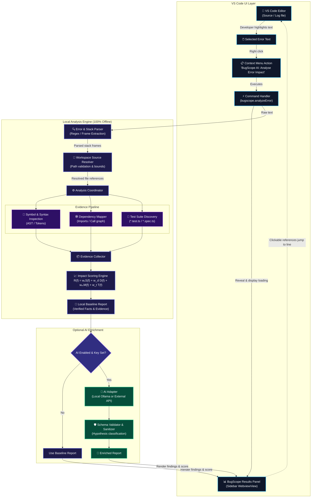

# BugScope AI

<div align="center">

**VS Code-Native · Local-First · Evidence-Driven Error Impact Analysis**

*Understand an error, trace its potential impact, and prioritise what to investigate next — without leaving the editor.*

[](LICENSE)
[](https://code.visualstudio.com/)
[](PLAN.md)
[-orange)](PLAN.md)
[](test/)

</div>

---

## ⚡ Overview

**BugScope AI** turns raw stack traces and error messages into evidence-backed, local investigations of impacted code and tests worth running first — without leaving the editor or requiring external API keys.

### Core Workflow
1. **Highlight:** Select any error message or stack trace in an active editor tab (e.g. `.log`, `.ts`, `.js`, or terminal output pasted into a scratch buffer).
2. **Right-Click:** Choose `BugScope AI: Analyse Error Impact` from the editor context menu.
3. **Inspect:** BugScope's dedicated sidebar view resolves stack frames to actual workspace files, extracts AST dependencies, ranks impacted modules with explicit evidence, and highlights relevant test suites.
4. **Navigate:** Click any candidate reference or throw site to jump straight to that exact line in code.

---

## 🏗️ Architecture

<div align="center">



</div>

<details>
<summary><b>🔍 View Mermaid Source Diagram</b></summary>



</details>

---

## 🚀 Quickstart & Installation

### Option 1: Install Pre-Built VSIX
```bash
code --install-extension bugscope-ai-0.1.0.vsix
```

### Option 2: Run in Development Host
1. Clone repository and install dependencies:
   ```bash
   git clone https://github.com/saranraj1/BugScope-AI.git
   cd BugScope-AI
   npm install
   ```
2. Build extension:
   ```bash
   npm run build
   ```
3. Press `F5` in VS Code to launch the **Extension Development Host**.

---

## 🧪 Running Automated Tests

Run the complete 19-scenario test suite verifying parser robustness, path security boundaries, dependency mapping, impact ranking, and end-to-end flows:

```bash
npm test
```

Test coverage includes:
- ✅ **Valid TypeScript & JavaScript stack traces** (multiple frames, async wrappers)
- ✅ **Python tracebacks** (extracting bottom exception header & frames)
- ✅ **Bare error messages** (ReferenceError, TypeError without frames)
- ✅ **Malformed crash dumps** (graceful error handling without IDE crash)
- ✅ **Empty and arbitrary text selections** (defensive guidance prompts)
- ✅ **Path traversal prevention** (`../..` containment checks)
- ✅ **Sensitive file exclusion** (`.env`, `*.key`, `id_rsa`)
- ✅ **Unsaved dirty editor buffer preference** over stale disk contents
- ✅ **Static dependency & import graph construction** (1-hop & 2-hop distances)
- ✅ **Matching test suite discovery** and regression test guidance
- ✅ **100% offline baseline execution** and graceful handling of unavailable AI endpoints

---

## 🎯 90-Second Demo Procedure

1. Open `test/fixtures/traces/valid-typescript.log` in VS Code.
2. Highlight the 4 lines of the stack trace:
   ```text
   TypeError: Cannot read properties of undefined (reading 'rate')
       at calculateDiscount (src/checkout.ts:27:30)
       at processOrder (src/orderService.ts:9:20)
       at Object.handleCheckout (src/routes/cart.ts:4:18)
   ```
3. Right-click and select **`BugScope AI: Analyse Error Impact`**.
4. The **BugScope AI** sidebar opens instantly, showing:
   - **Throw Origin:** `src/checkout.ts:27` with surrounding code preview.
   - **Blast Radius:** Ranked candidate modules (`#1 checkout.ts`, `#2 orderService.ts`, `#3 routes/cart.ts`) with calculated impact scores and explicit dependency reasons.
   - **Targeted Test Coverage:** Links directly to `test/checkout.test.ts`.
5. Click on `src/checkout.ts` to navigate directly to the failure site in the editor.

---

## 📄 License & Specification
- **Master Plan & Technical Spec:** [PLAN.md](PLAN.md)
- **License:** [MIT](LICENSE)
