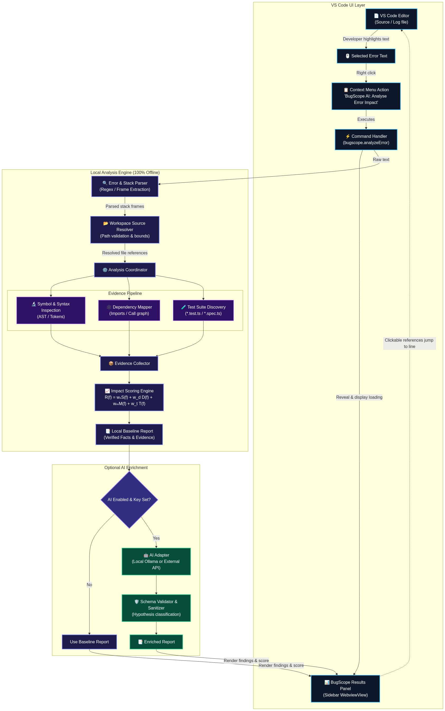
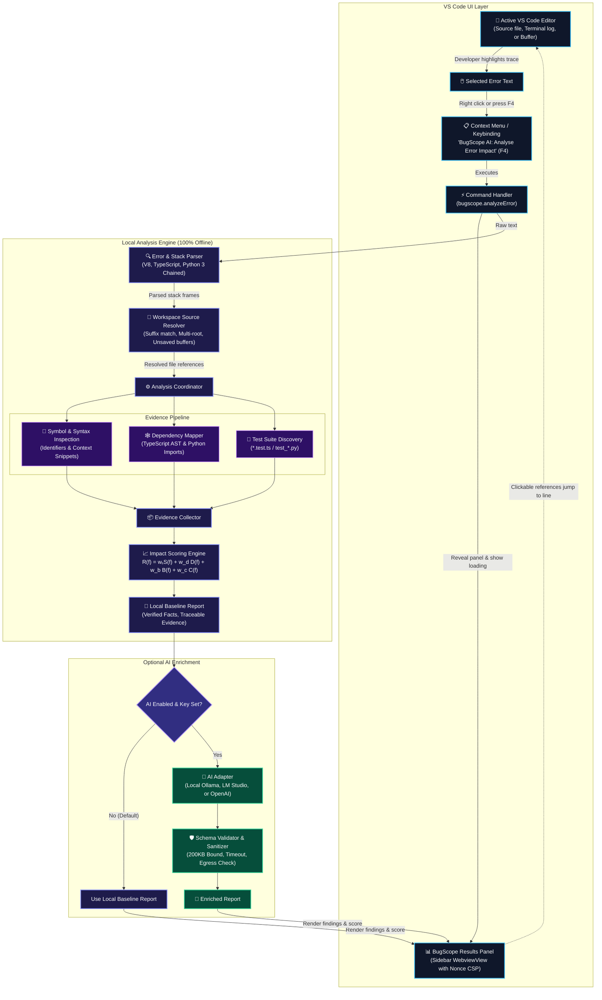

# BugScope AI

<div align="center">

**VS Code-Native · Local-First · Evidence-Driven Error Impact Analysis**

*Understand an error, trace its potential impact, and prioritise what to investigate next — without leaving the editor.*

[](package.json)
[](https://code.visualstudio.com/)
[](package.json)
[](PLAN.md)
[](tsconfig.json)
[](test/)
[](docs/REPAIR_REPORT.md)
[](LICENSE)

</div>

---

## ⚡ Overview

**BugScope AI** transforms raw runtime stack traces and terminal error dumps into transparent, evidence-backed investigations of impacted code and tests worth running first — entirely inside your active VS Code session without requiring cloud services, telemetry, or mandatory API keys.

When software crashes, the underlying defect rarely lives purely on the throw line. Developers spend significant cognitive effort manually tracing callers, inspecting imported utilities, and guessing which test suites to execute. BugScope AI automates this investigation in under a second using deterministic static analysis:

1. **Parses Errors & Stack Frames:** Extracts structured frames from Node.js/V8, TypeScript, and Python 3 tracebacks (including chained `raise ... from` exceptions).
2. **Resolves Workspace Source Locations:** Maps stack frames to canonical filesystem files using directory suffix disambiguation and in-memory editor buffer priority.
3. **Maps AST Dependency Graphs:** Utilizes the official TypeScript Compiler API and Python AST parsers to discover 1-hop and 2-hop callers while respecting `tsconfig.json` path aliases (`@/*`, `~/*`).
4. **Calculates Multi-Vector Blast Radius:** Computes heuristic impact scores combining stack proximity, dependency adjacency, fan-in blast radius, and compound synergy.
5. **Surfaces Related Test Candidates:** Matches impacted modules against existing workspace test suites (`*.test.ts`, `*.spec.ts`, `test_*.py`).
6. **Enables One-Click Navigation:** Allows developers to jump directly to exact source lines directly from the sidebar.

> [!NOTE]
> **100% Local-First & Zero Telemetry:** Core analysis runs entirely offline on your CPU in under 1 second. No source code or error logs ever leave your workstation unless you explicitly configure an optional AI provider.

---

## 🏗️ Architecture & Analysis Flow

The BugScope AI pipeline cleanly separates input ingestion, static analysis, evidence aggregation, and presentation:

<div align="center">



</div>

<details>
<summary><b>🔍 View Interactive Mermaid Architecture Diagram</b></summary>



</details>

---

## 📊 Comprehensive Capability Matrix

| Feature / Domain | Implemented Support | Verified Mechanism & Constraints |
| :--- | :--- | :--- |
| **JavaScript / TypeScript** | ✅ Full AST Parsing | TypeScript Compiler API (`ts.createSourceFile`). Extracts static imports, re-exports (`export * from`), dynamic imports, CommonJS `require()`, and `tsconfig.json` path aliases (`@/*`, `~/*`). Completely ignores commented-out code and string literals. |
| **Python** | ✅ Native AST & RegEx | Multi-line parenthesized imports (`from m import (a, b)`), inline comments stripped, aliased imports (`import x as y`), relative package imports (`from .utils import f`). Virtual environments (`.venv`, `venv`, `__pycache__`) automatically excluded. |
| **Stack Trace Parsing** | ✅ Multi-Engine | V8 / Node.js stack traces, TypeScript transpilation stacks, Python 3 tracebacks (tracking chained `raise ... from` root exceptions), ANSI terminal escape code stripping, paths containing spaces, and Windows drive letters (`C:\...`). |
| **Source Resolution** | ✅ Multi-Root & Disambiguation | Resolves relative and absolute paths, multi-root workspace folders, verified directory suffix matching, and unsaved in-memory document priority. Rejects ambiguous duplicate basenames when multiple matches exist across different folders. |
| **Workspace Security** | ✅ Strict Containment | Mathematical `path.relative` containment algorithm (prevents sibling-prefix attacks), platform-aware path casing (Windows case-insensitivity vs Linux case-preservation), sensitive file exclusion (`.env`, `*.key`, `id_rsa`), and nonce-based Webview CSP. |
| **Dependency Mapping** | ✅ 1-Hop & 2-Hop Graph | Directional importer/callee edges, fan-in centrality tracking, circular dependency resolution, duplicate edge suppression, and a global scan budget (max 300 files) with explicit truncation reporting. |
| **Test Discovery** | ✅ Multi-Pattern Matching | Discovers existing test suites for impacted candidates (`*.test.ts`, `*.spec.ts`, `test_*.py`, `*_test.py`, `__tests__/*`). Clearly labels items as "related test candidates" without falsely claiming verified runtime test execution. |
| **Impact Ranking** | ✅ Calibrated Multi-Vector | Transparent multi-vector scoring formula: Stack proximity ($0.45$) + Dependency adjacency ($0.25$) + Fan-in blast radius ($0.15$) + Compound synergy ($0.15$). Scores strictly bounded between $0.0$ and $1.0$ with deterministic tie-breaking. |
| **AI Enrichment** | ⚡ Optional & Privacy-Guarded | Disabled by default ($100\%$ offline). Supports local Ollama (`localhost:11434`), LM Studio, or OpenAI. Request timeouts, bounded response streams ($200\text{ KB}$ limit), redirect rejection, and secure VS Code Keychain SecretStorage. |

---

## 🧮 Multi-Vector Impact Scoring Formula

BugScope AI uses a transparent, calibrated heuristic scoring model to rank candidates rather than relying on black-box opacity. The impact score $R(f)$ for any file $f$ is defined as:

$$R(f) = \min\left(1.0, \; w_s \cdot S(f) + w_d \cdot D(f) + w_b \cdot B(f) + w_c \cdot C(f)\right)$$

Where:
- **$S(f)$ — Stack Proximity ($w_s = 0.45$):**
  - Direct point of throw (top workspace frame): $S(f) = 1.0$
  - Frame 2 in stack trace: $S(f) = 0.8$
  - Frame 3 in stack trace: $S(f) = 0.6$
  - Other workspace frames: $S(f) = 0.4$
  - Non-stack frame candidates: $S(f) = 0.0$
- **$D(f)$ — Dependency Adjacency ($w_d = 0.25$):**
  - 1-hop upstream caller (importer of failing file): $D(f) = 0.8$
  - 1-hop downstream dependency (imported by failing file): $D(f) = 0.6$
  - 2-hop connected module: $D(f) = 0.4$
  - Unconnected candidate: $D(f) = 0.0$
- **$B(f)$ — Blast Radius / Centrality Boost ($w_b = 0.15$):**
  - Rewards high fan-in modules (files imported by multiple parts of the application). If fan-in $\ge 3$, $B(f) = 1.0$; if fan-in $= 2$, $B(f) = 0.5$.
- **$C(f)$ — Compound Synergy ($w_c = 0.15$):**
  - Boosts candidates that have converging evidence across multiple independent vectors (e.g., both present in stack trace AND identified as a high fan-in dependency caller).

### Confidence Tiers & Deterministic Sorting
- **`CRITICAL`** ($\ge 0.75$): Direct point of failure or immediate throwing caller.
- **`HIGH`** ($\ge 0.50$): Direct 1-hop upstream caller or frame closely tied to failure.
- **`MEDIUM`** ($\ge 0.30$): 2-hop connected dependency or related module.
- **`LOW`** ($< 0.30$): Distant dependency or peripheral candidate.
- **Tie-Breaking:** If two candidates produce identical impact scores, ranking is sorted deterministically by relative workspace path, ensuring identical results across runs.

---

## 🔒 Security & Privacy Engineering

BugScope AI was designed from the ground up under a zero-trust model for local developer environments:

### 1. Strict Path Containment & Sibling Traversal Immunity
- Replaces naive string `startsWith` containment with mathematical `path.relative` checking:
  ```ts
  const rel = path.relative(compareRoot, compareTarget);
  if (rel === '..' || rel.startsWith('..' + path.sep) || path.isAbsolute(rel)) {
    return false; // Out-of-workspace traversal rejected!
  }
  ```
- Sibling directory spoofing (e.g. `/my-workspace-other/secret.txt` matching `/my-workspace`) is provably rejected.

### 2. Symlink Escape Prevention
- Both candidate paths and workspace roots are dereferenced using `fs.realpathSync` before containment evaluation. Symlinks pointing to `/etc/passwd`, `~/.ssh`, or external drives cannot escape the workspace sandbox.

### 3. Nonce-Based Webview CSP
- Webview panels enforce a Content Security Policy with cryptographic nonces:
  ```http
  default-src 'none';
  script-src 'nonce-${nonce}';
  style-src 'nonce-${nonce}';
  img-src https: data: ${webview.cspSource};
  ```
- Strips `unsafe-inline` and `unsafe-eval`. All untrusted stack traces, snippets, and filenames are sanitized before HTML injection.

### 4. Webview Message Schema Validation
- Inbound messages from the webview are checked against a strict runtime schema:
  - Validates `OPEN_LOCATION` file strings and enforces integer line numbers $\ge 1$.
  - Drops unexpected actions, prototype pollutions, or malformed payloads.

### 5. OS-Backed SecretStorage Keychain
- Provider API keys are persisted strictly inside the VS Code SecretStorage keychain (`context.secrets`), never in plaintext `settings.json`.
- An explicit deletion flag (`bugscope.apiKeyExplicitlyDeleted`) ensures that deleting a key from the keychain cannot be undermined by stale fallback settings.

### 6. Controlled Egress & DoS Protection
- Rejects non-HTTP/HTTPS URLs (e.g. `ftp://` or `file://`).
- Explicitly rejects HTTP redirects (`redirect: 'error'`) to prevent token leaking to third-party endpoints.
- Implements a strict $200\text{ KB}$ response stream limit to prevent memory exhaustion from oversized model outputs.

---

## ⌨️ Commands, Keybindings & Menus

| Command ID | Title | Keybinding (Win/Linux) | Keybinding (macOS) | Availability |
| :--- | :--- | :--- | :--- | :--- |
| `bugscope.analyzeError` | **BugScope AI: Analyse Error Impact** | `F4` / `Shift+F4`<br/>`Alt+Shift+B` | `F4` / `Shift+F4`<br/>`Alt+Shift+B` | Editor Selection, Context Menu, Terminal Context Menu |
| `bugscope.clearAnalysis` | **BugScope AI: Clear Findings** | — | — | Sidebar View Title, Command Palette |
| `bugscope.configureApiKey` | **BugScope AI: Configure AI API Key** | — | — | Command Palette, Sidebar Action Link |

### Interactive Command Handling
- **When Text is Highlighted:** Instantly analyzes the selected stack trace or error message.
- **When No Text is Selected:** Rather than fabricating errors or failing silently, BugScope AI opens an interactive input box asking you to paste an error message or stack trace, or analyzes active file diagnostics.
- **Clipboard Hygiene:** If terminal text is probed, BugScope AI restores the developer's original clipboard contents across all exit branches.

---

## ⚙️ Configuration & Settings

Configure BugScope AI in your VS Code `settings.json`:

```json
{
  // Enable optional AI explanation enrichment (Default: false / 100% offline)
  "bugscope.ai.enabled": false,

  // OpenAI-compatible endpoint (Default: local Ollama)
  "bugscope.ai.endpoint": "http://localhost:11434/v1",

  // Model name (e.g. llama3.2, mistral, gpt-4o-mini)
  "bugscope.ai.model": "llama3.2",

  // Maximum tokens generated by optional AI provider (100 - 2000)
  "bugscope.ai.maxTokens": 600,

  // Sampling temperature (0.0 - 1.0)
  "bugscope.ai.temperature": 0.2
}
```

> [!TIP]
> **Connecting Local Ollama (Zero Cost & Offline):**
> 1. Run `ollama run llama3.2` in your terminal.
> 2. Set `"bugscope.ai.enabled": true` and `"bugscope.ai.endpoint": "http://localhost:11434/v1"`.
> 3. Leave the API key blank — Ollama requires no authentication!

---

## 🧪 Comprehensive Verification & Test Suite

BugScope AI includes **56 automated test scenarios** covering every phase of the pipeline.

```bash
# 1. Verify TypeScript type correctness (0 compiler errors)
npm run compile

# 2. Run the complete test suite
npm test
```

```text
  Audit Regression & Edge Case Verification
    √ Audit B.1: Parses V8 stack frame with method aliases [as handler]
    √ Audit B.2: Parses paths containing spaces in stack frame
    √ Audit B.3: Generic path parsing preserves Windows drive letter
    √ Audit C.1: WorkspaceSecurity handles symlinks and prevents escape
    √ Audit D.1: Resolves /index.tsx module specifiers
    √ Audit E.1: ImpactScorer tie-breaking is deterministic when scores are equal
    √ Audit E.2: Candidates with missing signals do not throw and receive zero sub-score
    √ Audit C.2: Workspace sibling-prefix containment attack rejection
    √ Audit C.3: Webview message validation rejects malformed and malicious messages
    √ Audit D.2: AST import extraction ignores TypeScript comments and strings with import syntax
    √ Audit D.3: Global scan budget enforcement respects maxFilesScan and reports truncation
    √ Audit D.4: Multi-root workspace analysis indexes files across multiple workspace folders
    √ Audit D.5: SourceResolver rejects ambiguous duplicate basenames without matching directory evidence
    √ Audit F.1: AiAdapter rejects non-http/https protocol and fails safely

  CredentialStore Unit Tests
    √ 1. Returns undefined when no API key is stored
    √ 2. Securely stores and retrieves trimmed API key
    √ 3. Deletes API key on request or when storing empty string
    √ 4. Tracks first-time onboarding prompt state
    √ 5. Prompts and saves API key via UI host
    √ 6. First-time onboarding prompts once and triggers key setup on user consent

  DependencyAnalyzer Tests
    √ 1. Extracts static imports and builds relationship graph
    √ 2. Discovers 1-hop and 2-hop connected modules
    √ 3. Extracts native Python imports and builds dependency graph
    √ 4. Discovers 1-hop and 2-hop connected modules in Python project
    √ 5. Correctly extracts multi-line parenthesized Python imports with comments
    √ 6. Resolves modern TypeScript @/ and ~/ path aliases against src/ directory

  BugScope AI - End-to-End Workflow Tests
    √ 1. Executes complete local analysis on valid error fixture
    √ 2. Gracefully handles unavailable AI endpoint without failing local report
    √ 3. AiAdapter safely accepts apiKey and fails gracefully if endpoint is unreachable
    √ 4. Executes complete local analysis on native Python traceback fixture
    √ 5. Formats AnalysisReport into structured, shareable Markdown summary

  ErrorParser Automated Tests
    √ 1. Parses a valid TypeScript stack trace with multiple frames
    √ 2. Parses a Python traceback with line and function names
    √ 3. Parses bare error message without stack frames
    √ 4. Handles malformed stack trace without throwing exception
    √ 5. Handles completely empty selection with polite guidance
    √ 6. Detects ordinary code selection and warns instead of fabricating error
    √ 7. Parses CleanFileCheck correctly with 0 errors detected and clean scope
    √ 8. Strips terminal ANSI escape codes and extracts frames cleanly
    √ 9. Correctly prioritizes final fatal exception in Python chained traceback

  calculateDiscount Unit Tests
    √ should return 0 when cart is empty
    √ should calculate discount when discount code is provided

  ImpactScorer Tests
    √ 1. Correctly prioritizes direct throw site over callers
    √ 2. Prioritizes upstream caller (importer) over downstream dependency (callee)
    √ 3. Rewards high fan-in centrality with blast radius boost
    √ 4. Multi-vector compound synergy boosts candidate with converging evidence
    √ 5. Normalizes top workspace frame when underlying throw is in external runtime
    √ 6. Accurately classifies confidence tiers (CRITICAL, HIGH, MEDIUM, LOW)

  SourceResolver & WorkspaceSecurity Tests
    √ 1. Resolves relative path to actual workspace file
    √ 2. Captures code context snippet with target line highlight
    √ 3. Rejects paths attempting directory traversal outside workspace
    √ 4. Handles missing file in stack trace gracefully
    √ 5. Prefers unsaved in-memory document content over disk
    √ 6. Identifies and blocks sensitive files like .env or private keys
    √ 7. Resolves native Python stack frames and captures Python context snippets
    √ 8. WorkspaceSecurity correctly ignores Python virtual environments and caches

  56 passing (871ms)
```

---

## 🎯 Step-by-Step Demos

### Demo 1: TypeScript / Node.js Runtime Exception

1. Open [`test/fixtures/traces/valid-typescript.log`](test/fixtures/traces/valid-typescript.log) in VS Code.
2. Select the stack trace:
   ```text
   TypeError: Cannot read properties of undefined (reading 'rate')
       at calculateDiscount (src/checkout.ts:27:30)
       at processOrder (src/orderService.ts:9:20)
       at Object.handleCheckout (src/routes/cart.ts:4:18)
   ```
3. Press `F4` or right-click and choose **BugScope AI: Analyse Error Impact**.
4. The sidebar instantly displays:
   - **Failure Origin:** `src/checkout.ts:27` with the code context snippet and highlighted target line.
   - **Ranked Blast Radius Candidates:**
     - `#1 src/checkout.ts` (Score: `1.00`, Tier: `CRITICAL`) — Direct Throw Site.
     - `#2 src/orderService.ts` (Score: `0.55`, Tier: `HIGH`) — Direct 1-hop static importer.
     - `#3 src/routes/cart.ts` (Score: `0.35`, Tier: `MEDIUM`) — 2-hop connected caller.
   - **Related Test Candidates:** Links to [`test/checkout.test.ts`](test/checkout.test.ts).
5. Click **Open in Editor** on any card to jump immediately to that file and line.

### Demo 2: Python 3 Traceback with Chained Exceptions

1. Open [`test/fixtures/traces/python-traceback.log`](test/fixtures/traces/python-traceback.log) in VS Code.
2. Select the traceback:
   ```text
   Traceback (most recent call last):
     File "src/routes/cart.py", line 12, in post_checkout
       order_service.checkout_cart(cart)
     File "src/order_service.py", line 15, in checkout_cart
       return calculate_discount(cart)
     File "src/checkout.py", line 28, in calculate_discount
       discount_rate = cart['discount']['rate']
   KeyError: 'discount'
   ```
3. Press `F4`.
4. BugScope AI parses the bottom fatal exception (`KeyError: 'discount'`), resolves `src/checkout.py:28`, traverses Python import statements across `order_service.py` and `routes/cart.py`, and presents discovered test suites in `test_checkout.py`.

---

## 📁 Repository Structure

```text
BugScope-AI/
├── docs/
│   ├── REPAIR_TRACKER.md        # Phase-zero audit log & issue tracking matrix
│   └── REPAIR_REPORT.md         # Master completion and verification report
├── resources/
│   ├── architecture.png         # High-resolution architectural diagram
│   ├── architecture.svg         # Vector architecture graphic
│   └── icon.svg                 # Activity bar sidebar icon
├── src/
│   ├── ai/
│   │   └── aiAdapter.ts         # Hardened optional AI provider client
│   ├── analysis/
│   │   ├── dependencyAnalyzer.ts# TypeScript AST & Python import mapper
│   │   ├── errorParser.ts       # Multi-engine stack trace & error parser
│   │   ├── impactScorer.ts      # Multi-vector heuristic scoring formula
│   │   ├── reportBuilder.ts     # Analysis coordinator & markdown formatter
│   │   ├── sourceResolver.ts    # Workspace path & directory suffix resolver
│   │   ├── symbolAnalyzer.ts    # Syntax & identifier inspection
│   │   └── testDiscovery.ts     # Related test candidate finder
│   ├── commands/
│   │   └── analyzeError.ts      # Command handler & clipboard hygiene
│   ├── models/
│   │   └── analysisResult.ts    # Strict data contracts & Webview actions
│   ├── providers/
│   │   └── resultsViewProvider.ts# Sidebar webview provider with nonce CSP
│   ├── services/
│   │   └── credentialStore.ts   # VS Code SecretStorage keychain manager
│   ├── utils/
│   │   └── workspaceSecurity.ts # Path containment, symlinks, & validation
│   └── extension.ts             # Extension activation lifecycle
├── test/
│   ├── fixtures/                # Sample TS/Python projects & error logs
│   ├── auditVerification.test.ts# Regression tests for all security repairs
│   ├── credentialStore.test.ts  # Keychain storage & deletion tests
│   ├── dependencyAnalyzer.test.ts# AST imports & alias resolution tests
│   ├── endToEndAnalysis.test.ts # E2E local analysis & offline resilience tests
│   ├── errorParser.test.ts      # Stack trace parsing automated tests
│   ├── impactScorer.test.ts     # Scoring normalization & tie-breaker tests
│   └── sourceResolver.test.ts   # Suffix matching & containment tests
├── package.json                 # Extension manifest & configuration schema
├── tsconfig.json                # TypeScript compiler configuration
└── README.md                    # Project documentation & usage manual
```

---

## 🚀 Quickstart & Developer Workflow

### Installation via Pre-Built VSIX
```bash
code --install-extension bugscope-ai-0.2.3.vsix
```

### Building & Running from Source
```bash
# 1. Clone repository
git clone https://github.com/saranraj1/BugScope-AI.git
cd BugScope-AI

# 2. Install dependencies
npm install

# 3. Check TypeScript compilation (0 errors)
npm run compile

# 4. Run automated test suite
npm test

# 5. Build production bundle via esbuild
npm run build

# 6. Package VSIX extension
npx vsce package --no-dependencies
```

To run in the **VS Code Extension Development Host**, open the project directory in VS Code and press `F5`.

---

## 📄 License & Specifications

- **Technical Plan & Blueprint:** [PLAN.md](PLAN.md)
- **Repair Tracking Matrix:** [docs/REPAIR_TRACKER.md](docs/REPAIR_TRACKER.md)
- **Hardening & Audit Report:** [docs/REPAIR_REPORT.md](docs/REPAIR_REPORT.md)
- **License:** [MIT](LICENSE) © BugScope AI Contributors
